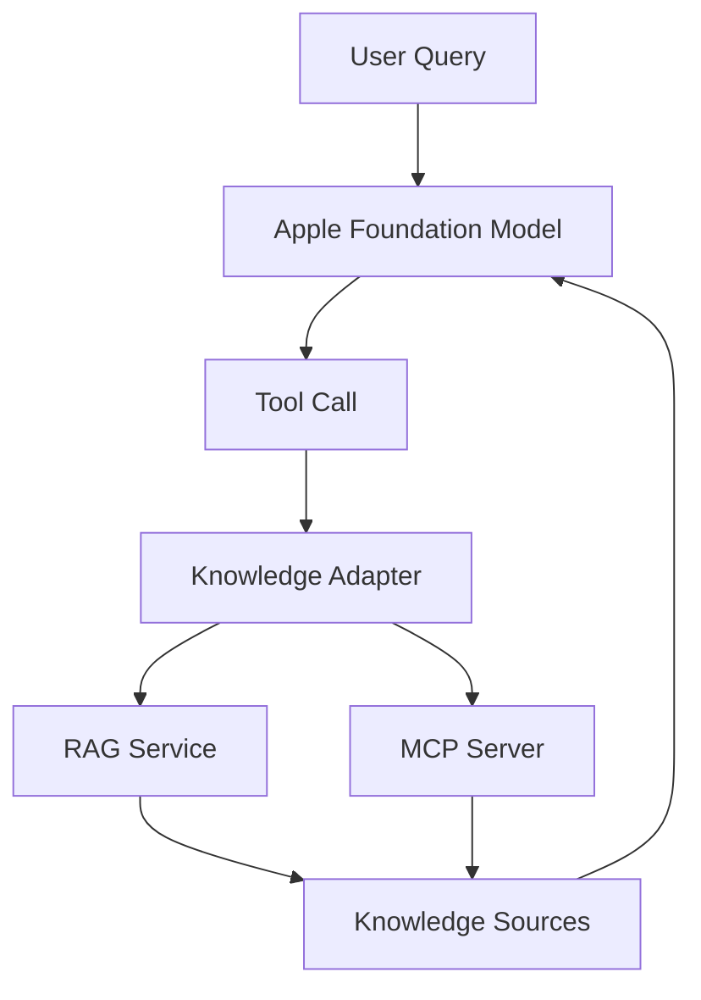

# Foundation Models + External Knowledge

> Connecting Apple Foundation Models to external RAG and MCP-powered knowledge systems.

## Overview

Apple's Foundation Models Framework provides a local, privacy-preserving language model available directly to macOS and iOS applications.

However, most real-world AI applications require access to domain-specific knowledge that is not contained within the model itself.

This project explores a simple question:

> Can Apple Foundation Models be combined with external Retrieval-Augmented Generation (RAG) systems and future MCP ecosystems through tool calling?

## Current Result

The technical integration is proven: Apple Foundation Models can call a static
Tessera MCP tool catalog through this bridge and receive tool output from the
local RAG system.

The CLI can also select a local Core AI `qwen3-4b` bundle exported from the
adjacent `coreai-models` checkout. With the updated Core AI Foundation Models
adapter, the same Tessera tool bridge can run against that local bundle and
print observed Tessera tool calls.

The current Apple Foundation Models runtime is not practically usable for the
tested DSB RAG workload. Live runs against the DSB data set hit the observed
4096-token model context limit after ordinary retrieval steps, for example:

```text
Foundation Models generation failed: Content contains 4100 tokens, which exceeds the maximum allowed context size of 4096.
```

Trying to hide that limit in the bridge by aggressively truncating or
interpreting tool output would change the evidence available to the model and
would invalidate the purpose of this proof of concept. The result of Phase 1 is
therefore:

- MCP/RAG tool integration: technically demonstrated.
- DSB-scale grounded answering with the current Apple context limit: not
  useful enough to continue investigating in this shape.

This repository remains a record of the integration path and the limitation
found during validation.

---

## Development

### Requirements

- macOS 27 or newer.
- Xcode with a macOS 27 SDK or newer.
- Swift 6.2 or newer.
- An adjacent `/Users/michael/src/coreai-models` checkout when using
  `--coreai-model`.

If the active command-line tools do not point at the required Xcode, prefix Swift
commands with the matching developer directory:

```sh
DEVELOPER_DIR=/Applications/Xcode-beta.app/Contents/Developer swift build
```

### Build And Test

```sh
swift build
swift test
```

### Run

```sh
swift run fm-rag "Answer in one short sentence: what is 2 + 2?"
```

On a supported machine with Apple Intelligence enabled, the Phase 1 CLI checks
Foundation Models availability, sends the question to the local system language
model, and prints a non-empty answer:

```text
Question: Answer in one short sentence: what is 2 + 2?
Foundation Models: available
Answer: <model response>
```

For grounded questions, start the local Tessera MCP server with the configured
acceptance data set in another terminal:

```sh
cd /Users/michael/src/tessera
cargo make up-dsb
```

Then run the CLI from this repository:

```sh
swift run fm-rag "Welcher Mindestimpuls ist für 9 mm Luger vorgeschrieben?"
```

The CLI exposes the static Tessera MCP tool catalog to Apple Foundation Models.
The model decides which Tessera tools to call. Observed tool calls are printed
before the final answer:

```text
Question: Welcher Mindestimpuls ist für 9 mm Luger vorgeschrieben?
Foundation Models: available
Tool: <tessera-tool-name> arguments=<compact-json>
Answer: <model response>
```

With the DSB data set, this path is expected to be constrained by the observed
4096-token Foundation Models context limit. A generation failure after a
successful Tessera tool call is a model-context limitation unless the error
message indicates a different cause.

To test the same RAG bridge with Core AI `qwen3-4b`, export the supported model
bundle from the adjacent checkout:

```sh
cd /Users/michael/src/coreai-models
uv run coreai.llm.export qwen3-4b --platform macOS
```

Validate the bundle with the Core AI reference runner:

```sh
swift run -c release llm-runner \
  --model /Users/michael/src/coreai-models/exports/qwen3_4b_4bit_dynamic \
  --prompt "Answer in one short sentence: what is 2 + 2?"
```

Then run the RAG CLI with the explicit Core AI model path:

```sh
swift run fm-rag \
  --coreai-model /Users/michael/src/coreai-models/exports/qwen3_4b_4bit_dynamic \
  "Nutze Tessera tools. Welcher Mindestimpuls ist fuer 9 mm Luger vorgeschrieben?"
```

Expected output starts by identifying the selected local model and bundle path,
then prints observed Tessera tool calls before the final answer:

```text
Question: Nutze Tessera tools. Welcher Mindestimpuls ist fuer 9 mm Luger vorgeschrieben?
Model: Core AI qwen3-4b
Model path: /Users/michael/src/coreai-models/exports/qwen3_4b_4bit_dynamic
Tool: <tessera-tool-name> arguments=<compact-json>
Answer: <model response>
```

The upstream Core AI tool-calling fix was tracked as
[`apple/coreai-models#28`](https://github.com/apple/coreai-models/issues/28).
The CLI uses `CoreAILanguageModel(resourcesAt:)` directly; it does not hardcode
retrieval, bypass the Tessera MCP client, or hide retrieval orchestration in the
CLI.

The Tessera system instructions require the model to inspect the available tool
names, descriptions, and argument schemas as a capability catalog before
selecting tools.

If Foundation Models is unavailable on the current machine, the CLI prints the
availability reason and exits nonzero before creating a session:

```text
Question: Answer in one short sentence: what is 2 + 2?
Foundation Models: unavailable (<availability reason>)
```

### Xcode

Open the repository root in Xcode. Xcode should load the Swift package and show
the `fm-rag` executable target or `FMRagCLI` scheme.

When running the CLI from Xcode with the debugger attached, Apple's Foundation
Models framework may print Biome instrumentation messages such as
`GenerativeModels.GenerativeFunctions.Instrumentation` or
`com.apple.biome.access.user` to the Xcode console. Those messages are emitted
by the Apple framework while it records local instrumentation events. They are
not produced by this CLI. Application-level generation failures are printed as
`Foundation Models generation failed: ...`.

If the Xcode debugger output is noisy or generation stalls there while the same
command works in Terminal, run the scheme without the debugger attached:

1. Open Product > Scheme > Edit Scheme.
2. Select Run > Info.
3. Disable Debug executable.
4. Run the `fm-rag` scheme again.

Generated package state, Xcode user state, derived data, and runtime outputs are
not committed.

If Xcode reports a stale SwiftPM manifest error such as `ManifestLoading`
already existing, close Xcode and remove generated local state before reopening
the repository root:

```sh
rm -rf .swiftpm .build runtime
```

---

## Why This Project Exists

The AI ecosystem is converging around two separate concerns:

### Reasoning

Language models provide:

- reasoning
- summarization
- generation
- structured output

### Knowledge

External systems provide:

- regulations
- manuals
- documentation
- company knowledge
- technical standards
- domain expertise

Today, knowledge is typically supplied through:

- RAG
- Vector databases
- Search systems
- MCP servers

Apple Foundation Models solve the reasoning problem.

This project investigates how they can participate in the broader knowledge ecosystem.

---

## Architecture

```text
User
  ↓
Apple Foundation Model
  ↓
Tool Call
  ↓
Knowledge Adapter
  ↓
RAG Service / MCP Client
  ↓
Knowledge Sources
```

### Architecture Diagram



---

## Key Idea

This project does **not** attempt to replace:

- RAG
- MCP
- Vector databases
- Existing retrieval infrastructure

Instead, it treats Apple Foundation Models as another inference backend that can leverage those systems.

```text
Foundation Model
       +
External Knowledge
       =
Grounded Responses
```

Phase 1 now exposes the local Tessera MCP server through a static Apple
Foundation Models tool catalog. The bridge uses the Tessera tool names and
descriptions from the local Tessera source instead of calling MCP `tools/list`
at runtime.

---

## Why Not Just Use RAG?

RAG alone retrieves information.

It does not provide:

- local natural language reasoning
- local summarization
- local answer generation
- local privacy-preserving inference

Foundation Models provide these capabilities.

The goal is to combine the strengths of both.

---

## Why Not Just Use ChatGPT or Claude?

Cloud-hosted frontier models are extremely capable.

However they introduce:

- API costs
- external dependencies
- privacy considerations
- vendor lock-in

Foundation Models offer:

- on-device execution
- zero inference cost
- system integration
- privacy-preserving workflows

This project explores whether external knowledge can be added while retaining those advantages.

---

## Goals

### Primary Goals

- Demonstrate tool calling from Foundation Models.
- Integrate external retrieval systems.
- Produce grounded responses.
- Remain domain independent.
- Avoid vendor lock-in.

### Secondary Goals

- Explore MCP compatibility.
- Improve observability.
- Establish reusable architectural patterns.

---

## Non-Goals

This project is not:

- a new RAG framework
- a replacement for MCP
- a production agent platform
- a benchmark suite
- a fine-tuning platform

---

## Example Use Cases

### Technical Documentation

```text
Private Notes
      +
Framework Documentation
      +
Foundation Model
```

### Engineering Standards

```text
Project Data
      +
Standards
      +
Foundation Model
```

### Sports Regulations

```text
Competition Data
      +
Rule Books
      +
Foundation Model
```

### Legal Research

```text
Case Information
      +
Legal Sources
      +
Foundation Model
```

---

## Planned Components

### macOS Application

Responsibilities:

- Foundation Models integration
- Tool registration
- User interface
- Logging

### Knowledge Adapter

Responsibilities:

- Tool abstraction
- Backend normalization
- Source attribution

### Retrieval Backend

Possible implementations:

- Qdrant
- LanceDB
- PostgreSQL + pgvector
- Weaviate

### Document Pipeline

Possible implementations:

- Docling
- FastEmbed
- Custom ingestion pipelines

---

## Roadmap

### Phase 1

- Foundation Model integration
- Single retrieval tool
- Basic RAG backend

### Phase 2

- Source attribution
- Observability
- Multiple retrieval providers

### Phase 3

- MCP compatibility layer
- Hybrid knowledge workflows
- Community contributions

---

## Future Direction

One particularly interesting direction is the integration of Foundation Models with MCP-based ecosystems.

```text
Foundation Model
      ↓
Knowledge Tool
      ↓
MCP Client
      ↓
Any MCP Server
```

If successful, Apple Foundation Models could become a local reasoning layer for the broader open AI tooling ecosystem.

---

## Contributing

Contributions are welcome.

Areas of interest include:

- Foundation Models
- Tool Calling
- MCP Integration
- Retrieval Systems
- Observability
- Evaluation Methodologies

---

## License

MIT or Apache 2.0.

The project aims to remain open, interoperable, and vendor-neutral.

---

## Status

🚧 Early design and proof-of-concept phase.

The primary goal is validating the architecture and identifying best practices for integrating Apple Foundation Models with external knowledge systems.
