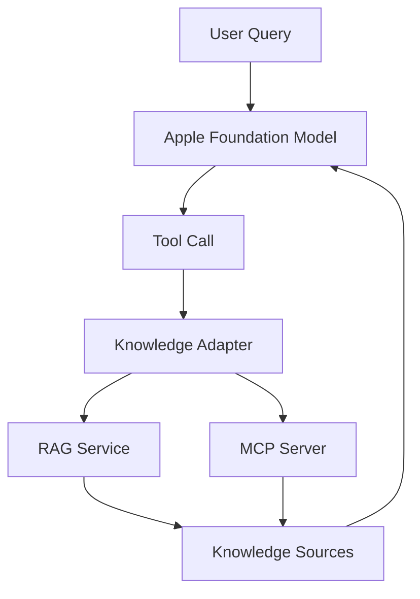

# Foundation Models + External Knowledge

> Connecting Apple Foundation Models to external RAG and MCP-powered knowledge systems.

## Overview

Apple's Foundation Models Framework provides a local, privacy-preserving language model available directly to macOS and iOS applications.

However, most real-world AI applications require access to domain-specific knowledge that is not contained within the model itself.

This project explores a simple question:

> Can Apple Foundation Models be combined with external Retrieval-Augmented Generation (RAG) systems and future MCP ecosystems through tool calling?

The answer appears to be yes.

This repository demonstrates an architecture where Apple Foundation Models act as a local reasoning engine while external knowledge systems provide authoritative domain expertise.

---

## Why This Project Exists

The AI ecosystem is converging around two separate concerns:

### Reasoning

Language models provide:

- reasoning
- summarization
- generation
- structured output

### Knowledge

External systems provide:

- regulations
- manuals
- documentation
- company knowledge
- technical standards
- domain expertise

Today, knowledge is typically supplied through:

- RAG
- Vector databases
- Search systems
- MCP servers

Apple Foundation Models solve the reasoning problem.

This project investigates how they can participate in the broader knowledge ecosystem.

---

## Architecture

```text
User
  ↓
Apple Foundation Model
  ↓
Tool Call
  ↓
Knowledge Adapter
  ↓
RAG Service / MCP Client
  ↓
Knowledge Sources
```

### Architecture Diagram



---

## Key Idea

This project does **not** attempt to replace:

- RAG
- MCP
- Vector databases
- Existing retrieval infrastructure

Instead, it treats Apple Foundation Models as another inference backend that can leverage those systems.

```text
Foundation Model
       +
External Knowledge
       =
Grounded Responses
```

---

## Why Not Just Use RAG?

RAG alone retrieves information.

It does not provide:

- local natural language reasoning
- local summarization
- local answer generation
- local privacy-preserving inference

Foundation Models provide these capabilities.

The goal is to combine the strengths of both.

---

## Why Not Just Use ChatGPT or Claude?

Cloud-hosted frontier models are extremely capable.

However they introduce:

- API costs
- external dependencies
- privacy considerations
- vendor lock-in

Foundation Models offer:

- on-device execution
- zero inference cost
- system integration
- privacy-preserving workflows

This project explores whether external knowledge can be added while retaining those advantages.

---

## Goals

### Primary Goals

- Demonstrate tool calling from Foundation Models.
- Integrate external retrieval systems.
- Produce grounded responses.
- Remain domain independent.
- Avoid vendor lock-in.

### Secondary Goals

- Explore MCP compatibility.
- Improve observability.
- Establish reusable architectural patterns.

---

## Non-Goals

This project is not:

- a new RAG framework
- a replacement for MCP
- a production agent platform
- a benchmark suite
- a fine-tuning platform

---

## Example Use Cases

### Technical Documentation

```text
Private Notes
      +
Framework Documentation
      +
Foundation Model
```

### Engineering Standards

```text
Project Data
      +
Standards
      +
Foundation Model
```

### Sports Regulations

```text
Competition Data
      +
Rule Books
      +
Foundation Model
```

### Legal Research

```text
Case Information
      +
Legal Sources
      +
Foundation Model
```

---

## Planned Components

### macOS Application

Responsibilities:

- Foundation Models integration
- Tool registration
- User interface
- Logging

### Knowledge Adapter

Responsibilities:

- Tool abstraction
- Backend normalization
- Source attribution

### Retrieval Backend

Possible implementations:

- Qdrant
- LanceDB
- PostgreSQL + pgvector
- Weaviate

### Document Pipeline

Possible implementations:

- Docling
- FastEmbed
- Custom ingestion pipelines

---

## Roadmap

### Phase 1

- Foundation Model integration
- Single retrieval tool
- Basic RAG backend

### Phase 2

- Source attribution
- Observability
- Multiple retrieval providers

### Phase 3

- MCP compatibility layer
- Hybrid knowledge workflows
- Community contributions

---

## Future Direction

One particularly interesting direction is the integration of Foundation Models with MCP-based ecosystems.

```text
Foundation Model
      ↓
Knowledge Tool
      ↓
MCP Client
      ↓
Any MCP Server
```

If successful, Apple Foundation Models could become a local reasoning layer for the broader open AI tooling ecosystem.

---

## Contributing

Contributions are welcome.

Areas of interest include:

- Foundation Models
- Tool Calling
- MCP Integration
- Retrieval Systems
- Observability
- Evaluation Methodologies

---

## License

MIT or Apache 2.0.

The project aims to remain open, interoperable, and vendor-neutral.

---

## Status

🚧 Early design and proof-of-concept phase.

The primary goal is validating the architecture and identifying best practices for integrating Apple Foundation Models with external knowledge systems.
