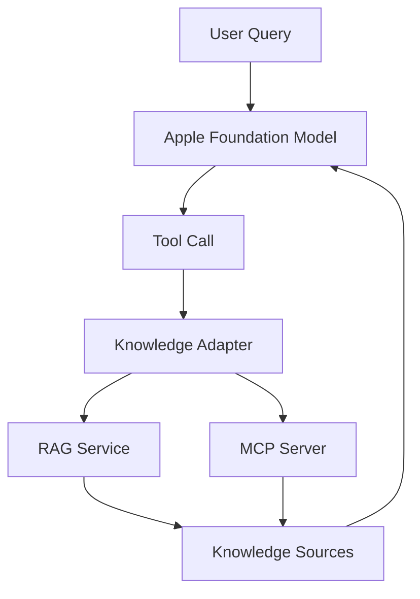

# Foundation Models + External Knowledge
## A Proof of Concept for Integrating Apple Foundation Models with RAG and MCP-Based Knowledge Systems

---

# Motivation

Apple's Foundation Models Framework introduces a local, privacy-preserving language model that can be used directly by third-party applications. While the framework provides generation, structured output, and tool-calling capabilities, it does not currently offer a complete solution for domain-specific knowledge retrieval.

At the same time, Retrieval-Augmented Generation (RAG) and the Model Context Protocol (MCP) have emerged as de-facto standards for connecting language models to external knowledge systems.

This project explores whether Apple Foundation Models can act as a local reasoning engine while relying on external retrieval systems for domain expertise.

The resulting architecture could enable developers to combine:

- Local inference
- Private user data
- Public knowledge sources
- Existing RAG infrastructure
- Future MCP ecosystems

without requiring cloud-hosted frontier models.

---

# Problem Statement

Modern AI applications require two distinct capabilities:

1. Reasoning and language generation
2. Access to authoritative domain knowledge

Apple Foundation Models address the first problem.

RAG systems address the second.

The central question of this project is:

> Can Apple Foundation Models be effectively augmented with external knowledge systems through tool calling?

---

# Goals

## Primary Goals

- Demonstrate tool-based retrieval using Foundation Models.
- Integrate an external RAG service.
- Keep the architecture domain-independent.
- Validate grounded response generation.
- Establish a reusable architectural pattern.

## Secondary Goals

- Evaluate future MCP compatibility.
- Explore observability and debugging.
- Measure developer experience.

---

# Non-Goals

The project intentionally does not attempt to:

- Train or fine-tune models.
- Replace existing RAG frameworks.
- Build a production-ready agent platform.
- Benchmark Foundation Models against frontier models.
- Solve long-term memory or personalization.

---

# Related Work

## Apple Foundation Models Framework

Provides:

- Local inference
- Structured generation
- Tool calling
- Guided generation

## Retrieval-Augmented Generation (RAG)

Common architecture:

- Document ingestion
- Chunking
- Embeddings
- Retrieval
- Context injection

## Model Context Protocol (MCP)

Provides:

- Tool discovery
- Standardized tool invocation
- Model-independent integration

This project sits at the intersection of these technologies.

---

# High-Level Architecture

```text
User
  ↓
Foundation Model
  ↓
Tool Call
  ↓
Knowledge Adapter
  ↓
RAG API / MCP Client
  ↓
Knowledge Sources
```

## Mermaid Diagram



---

# Demonstration Scenarios

## Scenario 1: Domain Question Answering

The model encounters a question requiring external knowledge.

Expected:

- Tool invocation
- Retrieval
- Grounded answer

## Scenario 2: Source Attribution

Expected:

- Retrieval of supporting passages
- Explicit citation of sources

## Scenario 3: Multi-Document Reasoning

Expected:

- Retrieval from multiple sources
- Synthesis of information

## Scenario 4: Retrieval Transparency

Expected:

- Visible tool execution
- Retrieval logs
- Debuggable workflow

---

# Technical Components

## macOS Application

Responsibilities:

- Foundation Models integration
- Tool registration
- UI
- Logging

## Knowledge Adapter

Responsibilities:

- Tool abstraction
- Request normalization
- Backend independence

## Retrieval Layer

Possible implementations:

- Qdrant
- LanceDB
- PostgreSQL + pgvector
- Weaviate

## Document Pipeline

Possible implementations:

- Docling
- FastEmbed
- Custom chunking

---

# Evaluation Criteria

## Functional

- Tool calling works reliably.
- Retrieved information affects output.
- Responses remain grounded.

## Architectural

- Retrieval backend is replaceable.
- Adapter layer remains stable.
- No vendor lock-in.

## Developer Experience

- Low integration complexity.
- Easy debugging.
- Clear separation of concerns.

---

# Future Work

## MCP Integration

Replace direct RAG APIs with MCP-based discovery.

```text
Foundation Model
      ↓
Knowledge Tool
      ↓
MCP Client
      ↓
Any MCP Server
```

## Hybrid Knowledge

Combine:

- Private user data
- Organizational knowledge
- Public domain knowledge

## Domain-Specific Applications

Potential domains:

- Legal
- Healthcare
- Engineering
- Technical Documentation
- Education
- Sports Regulations

---

# Expected Outcome

The project should demonstrate that Apple Foundation Models can operate as a local reasoning layer while external retrieval systems provide authoritative domain knowledge.

Rather than replacing RAG or MCP ecosystems, Foundation Models become an additional inference backend that combines:

- Privacy-preserving local execution
- Structured tool usage
- External retrieval
- Grounded answer generation

---

# Open Source Roadmap

## Phase 1

- Foundation Model integration
- Single retrieval tool
- Simple RAG backend

## Phase 2

- Source attribution
- Improved observability
- Multiple retrieval providers

## Phase 3

- MCP compatibility layer
- Advanced retrieval workflows
- Community contributions

---

# License

Recommended:

- MIT License
or
- Apache 2.0

to maximize adoption and interoperability.
